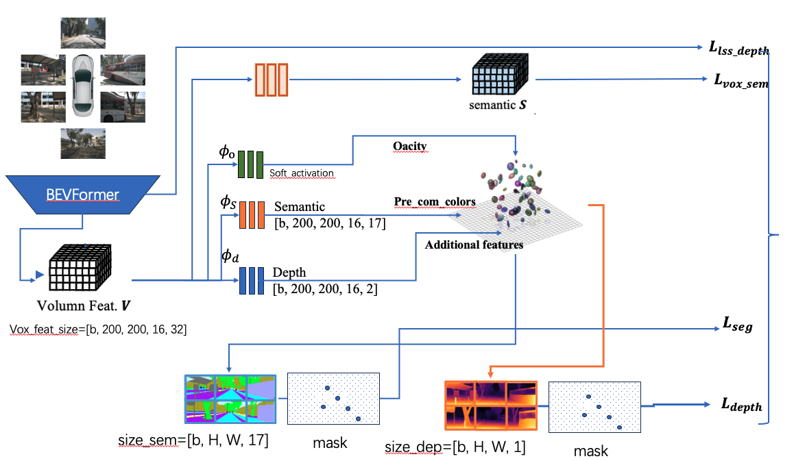

# SplattingOcc: Supervising 3D Occupancy Models with 2D Labels based on Gaussian Splatting.

## INTRODUCTION

**SplattingOcc** is a novel paradigm for training vision-centric 3D occupancy models **only with 2D labels**. Specifically, we extract a 3D Gaussian volume representation from multi-view images, and employ volume rendering techniques to establish 2D renderings, thus enabling direct 3D supervision from 2D semantics and depth labels. 



## Getting Started

- [Installation](docs/install.md)

- [Prepare Dataset](docs/prepare_datasets.md)

- Train 
  
  ```bash
  # Train SplattinOcc with 8 GPUs
  NODES=2
  NPROC_PER_NODE=4
  CUDA_VISIBLE_DEVICES=0,1,2,3 torchrun \
      --nnodes="${NODES}" \
      --node_rank="${NODE_RANK}" \
      --nproc_per_node="${NPROC_PER_NODE}" \
      --master_addr="${MASTER_ADDR}" \
      --master_port="${MASTER_PORT}" \
      tools/train.py \
      "configs/splattingocc/splattingocc-Nframe.py" \
      --launcher pytorch \
      --work_dir $WORK_DIR
  ```

  ```bash
  # Train SplattinOcc with 8 GPUs on A100 40G
  # change the script to run in run_2_nodes.sh with socc_8gpu.sh
  sbatch -N 2 -p vip_gpu_ailab -A ai4multi --qos gpugpu --gres=gpu:4 --job-name {$name} run_2_nodes.sh
  ```

- Evaluation 
  
  ```bash
  # Eval SplattinOcc with 8 GPUs
  NODES=2
  NPROC_PER_NODE=4
  CUDA_VISIBLE_DEVICES=0,1,2,3 torchrun \
     --nnodes="${NODES}" \
     --node_rank="${NODE_RANK}" \
     --nproc_per_node="${NPROC_PER_NODE}" \
     --master_addr="${MASTER_ADDR}" \
     --master_port="${MASTER_PORT}" \
     tools/test.py \
     configs/splattingocc/splattingocc-Nframe.py \
     $PTH_DIR \
     --launcher pytorch \
     --eval segm \
     --gpu-collect 
  ```

  ```bash
  # Eval SplattinOcc with 8 GPUs
  # change the script to run in run_2_nodes.sh with test.sh
  sbatch -N 2 -p vip_gpu_ailab -A ai4multi --qos gpugpu --gres=gpu:4 --job-name {$name} run_2_nodes.sh  
  ```

- Visualization
  
  ```bash
  # Dump predictions
  bash tools/dist_test.sh configs/splattingocc/splattingocc-Nframe.py latest.pth 1 --dump_dir=work_dirs/output
  # Visualization (select scene-id)
  python tools/visualization/visual.py work_dirs/output/scene-xxxx
  ```
  (The pkl file needs to be regenerated for visualization.)

- log
  ```
  ./log.txt records the specifications of changes in each experiments
<!-- 
## Model Zoo

| Method    | Backbone  | 2D-to-3D  | Lr Schd | GT | mIoU  | Config | Log | Download  |
|:---------:|:---------:|:---------:|:-------:|:-------:|:-----:|:-----:|:-----------------------------------------------:|:-------------------------------------------------------------------------------------------:|
| RenderOcc | Swin-Base | BEVStereo | 12ep    | 2D | 24.46 | [config](configs/renderocc/renderocc-7frame.py) | [log](https://github.com/pmj110119/storage/releases/download/v1/20231006_000233.log) | [model](https://github.com/pmj110119/storage/releases/download/v1/renderocc-7frame-12e.pth) |

* More model weights will be released later.

## Acknowledgement

Many thanks to these excellent open source projects:

- [BEVDet](https://github.com/HuangJunJie2017/BEVDet), [DVGO](https://github.com/sunset1995/DirectVoxGO), [Occ3D](https://github.com/Tsinghua-MARS-Lab/Occ3D), [SurroundDepth](https://github.com/JeffWang987/OpenOccupancy), [OpenOccupancy](https://github.com/JeffWang987/OpenOccupancy), [CVPR2023-Occ-Challenge](https://github.com/CVPR2023-3D-Occupancy-Prediction)

Related Projects:

- [SurroundOcc](https://github.com/weiyithu/SurroundOcc), [TPVFormer](https://github.com/wzzheng/TPVFormer), [BEVFormer](https://github.com/fundamentalvision/BEVFormer), [VoxFormer](https://github.com/NVlabs/VoxFormer), [FB-Occ](https://github.com/NVlabs/FB-BEV), [SimpleOccupancy](https://github.com/GANWANSHUI/SimpleOccupancy), [OVO](https://github.com/dzcgaara/OVO-Open-Vocabulary-Occupancy)

## BibTeX

If this work is helpful for your research, please consider citing:

```
@article{pan2023renderocc,
  title={RenderOcc: Vision-Centric 3D Occupancy Prediction with 2D Rendering Supervision},
  author={Pan, Mingjie and Liu, Jiaming and Zhang, Renrui and Huang, Peixiang and Li, Xiaoqi and Liu, Li and Zhang, Shanghang},
  journal={arXiv preprint arXiv:2309.09502},
  year={2023}
}
``` -->
